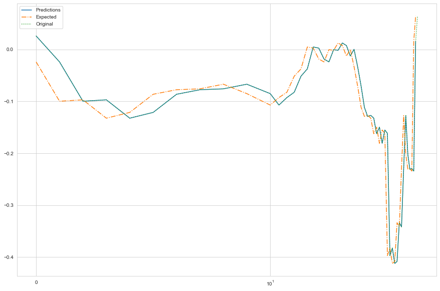

#  Netflix Stock Market Analysis

**By**: Jinsol Cantrall
****
## ●Overview●
Netflix became one of the successful video streaming websites that has been growing rapidly. The company itself has been investing internationally to attract viewers from all over the world. People are willing to pay monthly subscription fees just to watch one of the most popular TV shows at the moment. So how is it doing on the Stock Market? If you already have Netflix Stocks, is it better to keep or sell? Will there be any increase or decrease of the current value of stocks? DailyMarket Co. is here to help! Just download our mobile app and we will provide the most recent analysis daily.

## ●Business Problem●
▶ DailyMarket Co. is a start up mobile app company that provides stock market information such as forecasting the stock price. Company has hired a team to provide the most accurate forecasting on stock market closing prices. As a team member of the company, I will be doing Netflix Analysis and Predictions from 12 months to 36 months. It is crucial to provide the most accurate forecasting since the company just launched the mobile app.

## ●Data Understanding●

Yahoo Finance API <code>yfinance</code> is an easy way to recieve stock market information in real times. I was able to pull from the first launch of Netflix to today. 

## ●Results●

## ●Next Steps●

